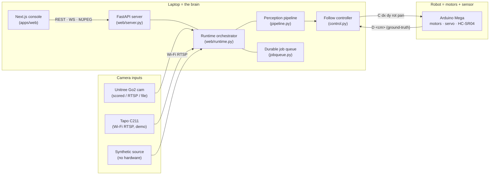
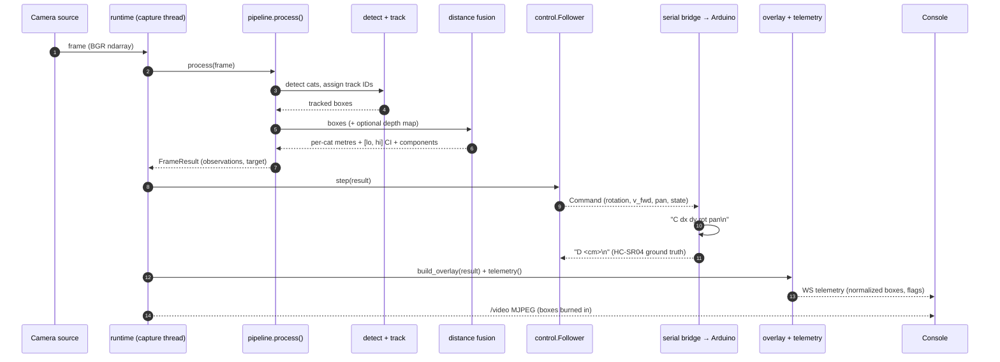
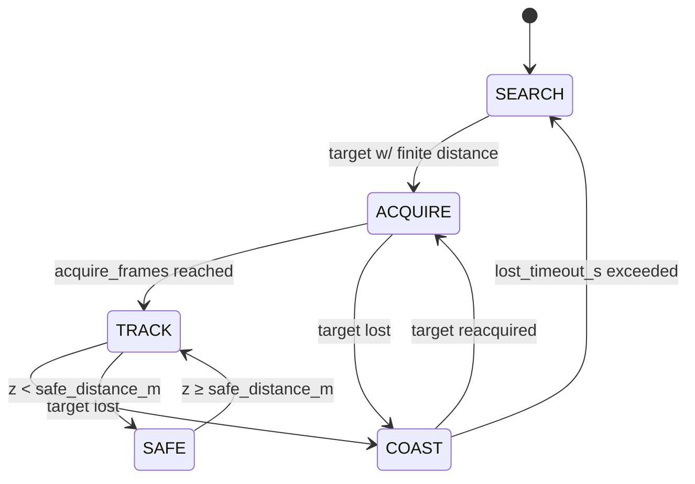
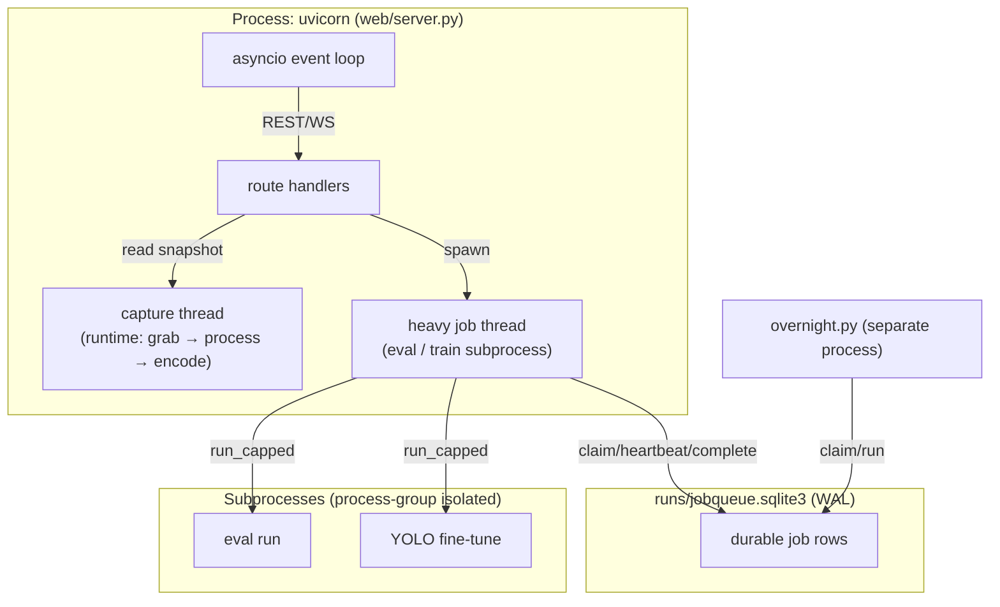
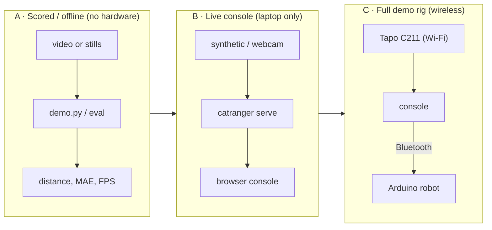

# Architecture Overview

> **TL;DR** — A camera produces frames. The **perception pipeline** turns each frame into
> a `FrameResult` (detected cats, stable track IDs, per-cat distance with a confidence
> interval). The **follow controller** turns that into a smooth robot `Command`. The
> **web control plane** (FastAPI + Next.js) wraps all of it with a live video overlay,
> manual/auto driving, safety E-stop, and observability. A **durable job queue** makes
> training and evaluation crash-safe. **Hardware** is optional: a Tapo camera over Wi-Fi
> and an Arduino robot over Bluetooth. The laptop is the brain; everything else is an
> input or an actuator.

---

## 1. System context

**Compute split:** laptop = brain (detection / depth / control), Arduino = motors +
ultrasonic sensor (over Bluetooth), Tapo = eyes (over Wi-Fi). No Raspberry Pi gateway —
the laptop talks to both devices wirelessly. See [hardware.md](hardware.md).

---

## 2. Component model

```mermaid
flowchart TB
  subgraph core["Scored perception core (frozen-metric law applies)"]
    intrinsics["intrinsics.py<br/>CameraModel: fx,fy,cx,cy,FOV"]
    detect["detect.py<br/>YOLO detector (pluggable backends)"]
    track["track.py<br/>BoT-SORT / ByteTrack IDs"]
    depth["depth.py<br/>UniDepth metric depth (optional)"]
    distance["distance.py<br/>geometry + depth fusion → metres + CI"]
    pipeline["pipeline.py<br/>orchestrates detect→track→distance"]
    types["types.py<br/>Detection, Distance, FrameResult, Command"]
  end

  subgraph control_layer["Control"]
    control["control.py<br/>Follower FSM + anti-oscillation"]
  end

  subgraph web["Web control plane"]
    server["web/server.py<br/>FastAPI routes + WS + MJPEG"]
    runtime["web/runtime.py<br/>capture thread, model home, jobs"]
    controllerw["web/controller.py<br/>telemetry assembly"]
    arbiter["web/arbiter.py<br/>single-driver token"]
    registry["web/registry.py<br/>model/profile registry"]
    sources["web/sources.py<br/>camera adapters"]
    overlay["web/overlay.py<br/>normalized overlay JSON"]
    store["web/store.py<br/>distance history ring"]
    evaljob["web/eval_job.py"]
    trainjob["web/train_job.py"]
  end

  subgraph offline["Training / evaluation / reliability"]
    prepare["train/prepare.py<br/>dataset → Ultralytics yaml"]
    train["train/train.py<br/>fine-tune YOLO (resumable)"]
    autoresearch["train/autoresearch.py<br/>keep/reject loop"]
    promote["train/promote.py<br/>winner → pipeline (gated)"]
    evalmetrics["eval/metrics.py + report.py"]
    gts["eval/gts.py + keepreject.py<br/>GT alignment + decision"]
    jobqueue["jobqueue.py<br/>durable SQLite queue"]
    proc["proc.py<br/>capped subprocess + retry"]
    history["history.py<br/>crash-safe artifacts"]
  end

  subgraph hw["Hardware adapters"]
    serial_bridge["hw/serial_bridge.py"]
    bluetooth["hw/bluetooth.py (BLE)"]
    tapo["hw/tapo.py (RTSP + PTZ)"]
    firmware["arduino/cat_ranger.ino"]
  end

  pipeline --> control
  detect --> track --> distance
  intrinsics --> distance
  depth --> distance
  runtime --> pipeline
  runtime --> control
  runtime --> sources
  runtime --> overlay
  runtime --> store
  runtime --> jobqueue
  server --> runtime
  server --> arbiter
  runtime --> registry
  control --> serial_bridge
  serial_bridge -.-> firmware
  bluetooth -.-> firmware
  tapo -.-> sources
  evaljob --> jobqueue
  trainjob --> jobqueue
  autoresearch --> gts
  train --> proc
```

The **dashed lines** cross a wireless/physical boundary.

---

## 3. Per-frame data flow (the hot path)

The MJPEG stream carries the **frame with boxes burned in server-side**; the WebSocket
carries **normalized geometry + flags** that the console draws as crisp text/badges on a
canvas aligned to the letterboxed video. This hybrid keeps text sharp at any zoom while
the heavy pixels travel once. See [web-control-plane.md](web-control-plane.md) and the
overlay contract in [reference/api.md](../reference/api.md).

---

## 4. Control state machine

The follower (`catranger/control.py`) is a P-controller wrapped in a five-state machine
with a strict per-channel anti-oscillation pipeline (deadband → EMA → slew-limit → clamp).

- **SEARCH** — no target; rotate slowly toward last-seen bearing, no forward motion.
- **ACQUIRE** — target seen; lock its track ID for `acquire_frames` frames before driving.
- **TRACK** — drive: rotation = `kp_rot·bearing`, forward = `kp_fwd·(Z − setpoint)`.
- **COAST** — target briefly lost; decay the last command toward zero for `lost_timeout_s`.
- **SAFE** — `Z < safe_distance_m`; back off. The Arduino *also* enforces a hard
  firmware stop below `SAFE_STOP_CM`, so safety is defended in two independent places.

---

## 5. Process & threading model

- The **capture thread** owns the camera + pipeline; route handlers read an atomic
  snapshot (latest JPEG, latest telemetry) so HTTP never blocks on the GPU.
- A **single heavy lock** serializes eval/train so they never contend for the GPU; a
  drive-mode switch is refused (HTTP 409) while training is active.
- Heavy work runs as a **process group** (`start_new_session=True`) so a timeout kills
  the whole tree with `os.killpg`, never an orphan. See
  [training-and-reliability.md](training-and-reliability.md).
- The **durable queue** is shared by the web server *and* the overnight runner — both
  claim atomically (`BEGIN IMMEDIATE`), so the same job is never run twice.

---

## 6. Deployment topologies

CatRanger runs in three escalating configurations; each is a strict superset of the last.

| Topology | Camera | Robot | Use |
|---|---|---|---|
| **A — Scored/offline** | file / Go2 stills | none | Reproduce the scored metrics; CI; training |
| **B — Live console** | synthetic / webcam / RTSP | dummy | Demo the console + perception with no rig |
| **C — Full rig** | Tapo C211 over Wi-Fi | Arduino over Bluetooth | The 90-second live "wow" demo |

The **pretrained baseline always runs** in every topology — it is the guaranteed demo
and the safety net. Fine-tuning is a time-boxed stretch on top and can be reverted with
one command (`make promote-revert`).

---

## 7. Key design decisions

| Decision | Why | Where |
|---|---|---|
| Distance = **geometry ⊕ depth fusion** with a CI, not a single number | Honest uncertainty; degrades gracefully when depth model is absent | [perception-core.md](perception-core.md) |
| **Two distance semantics** (camera→object, object→object) both reported | The brief is ambiguous; we state the assumption instead of guessing | [perception-core.md](perception-core.md) |
| Camera intrinsics in **YAML, selectable** (`go2` vs `tapo`) | Metric distance is sensor-specific; never hard-code numbers | [reference/configuration.md](../reference/configuration.md) |
| **Hybrid overlay** (boxes server-side, text client-side) | Sharp labels at any zoom; pixels travel once | [web-control-plane.md](web-control-plane.md) |
| **Durable SQLite queue** for all heavy jobs | Crash-safe train/eval; resume after kill; shared by web + overnight | [training-and-reliability.md](training-and-reliability.md) |
| **Process-group kill** + capped subprocess | A hung fine-tune can never wedge the demo or leak orphans | [training-and-reliability.md](training-and-reliability.md) |
| **Pluggable detectors + dataset registry** | Add a model/dataset by config, not code | [reference/configuration.md](../reference/configuration.md) |
| Safety in **two independent places** (controller SAFE + firmware stop) | Defense in depth for the only thing that can hurt someone | §4 above, [hardware.md](hardware.md) |

---

## 8. Where to go next

- The math and the four frozen metrics → [perception-core.md](perception-core.md)
- The console, runtime, arbiter, overlay → [web-control-plane.md](web-control-plane.md)
- Training, eval, keep/reject, crash recovery → [training-and-reliability.md](training-and-reliability.md)
- Cameras, robot, firmware, calibration → [hardware.md](hardware.md)
- Exact APIs / configs / commands → [reference/](../reference/)
- Get it running and tested → [guides/install-and-test.md](../guides/install-and-test.md)
