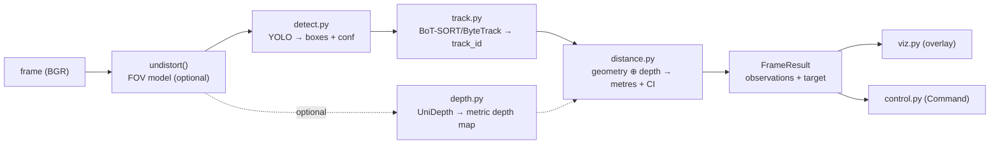
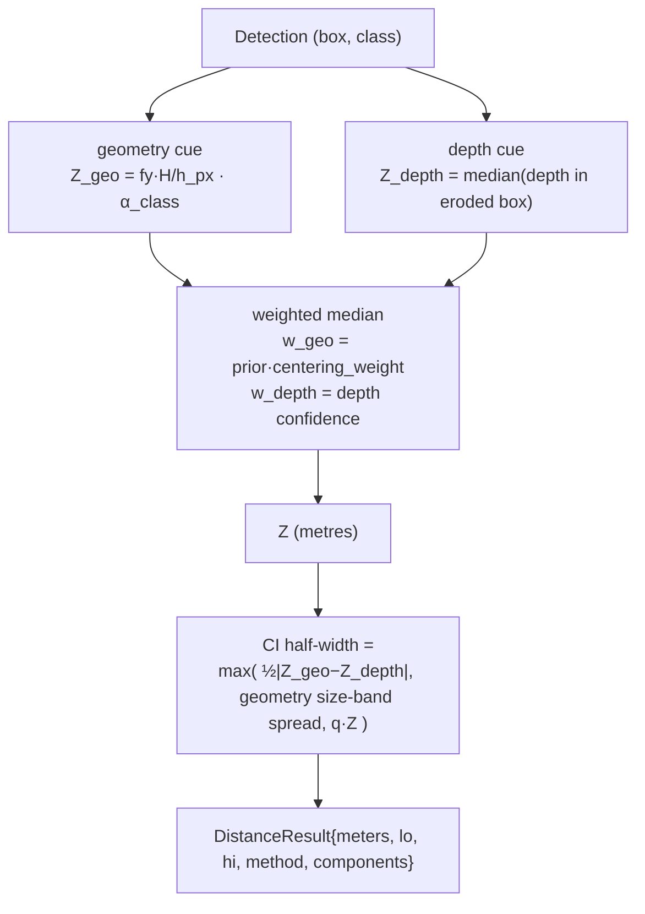
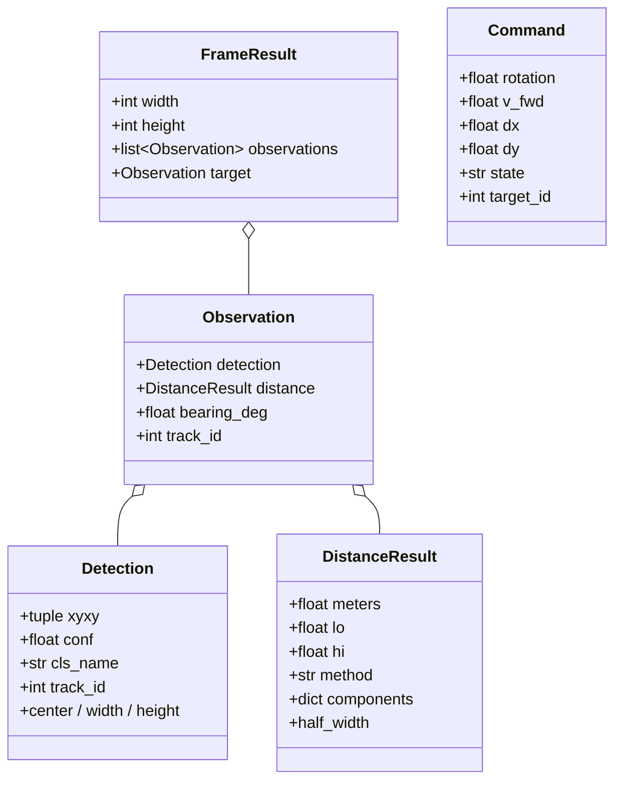

# Perception Core

> **TL;DR** — The perception core turns one frame into a `FrameResult`: a list of detected
> cats, each with a **stable track ID**, a **metric distance in metres**, and a
> **confidence interval**. Distance is the fusion of two independent cues — **geometry
> from apparent size** and **a metric depth network** — combined with a centering-weighted
> median and an honest CI. This is the **scored core**: the frozen-metric law applies —
> minimum code, no speculative knobs, surgical changes. Pure NumPy; the heavy models load
> lazily so the math is unit-tested without a GPU.

**Modules:** `intrinsics.py` · `detect.py` · `track.py` · `depth.py` · `distance.py` ·
`pipeline.py` · `viz.py` · `types.py` · `control.py` (consumes the result).

---

## 1. The four frozen metrics

Everything in this core exists to move one of these (`catranger/eval/metrics.py`):

| Metric | Definition | Target | Function |
|---|---|---|---|
| **Distance MAE** | `mean(|pred − gt|)` in metres (How Far) | minimize | `distance_mae()` |
| **Track continuity** | ID-switches, mean lifetime, longest single-ID streak | maximize streak / minimize switches | `track_stats()` |
| **FPS** | mean / p50 / p95 frame time | **≥ 15 FPS** | `fps_stats()` |
| **Command smoothness** | per-channel jerk + rotation oscillation count | minimize | `smoothness()` |

> The brief's "How Far" is ambiguous: *camera→object* vs *object→object*. CatRanger
> reports **camera→object** as the primary distance and can compute **object→object** via
> `CameraModel.inter_object_distance()`; both are stated, never guessed.

---

## 2. Pipeline stages



Each stage is independently swappable; `pipeline.py` wires them and is the only place
that knows the full sequence.

---

## 3. Camera model & intrinsics (`intrinsics.py`)

`CameraModel` wraps a `CameraConfig` (from YAML) and provides every geometric operation.
Intrinsics are **never hard-coded** — they are selected per camera (`go2_1080p` vs
`tapo_c211`) because metric distance is sensor-specific.

| Operation | Formula | Used for |
|---|---|---|
| `distance_from_height(h_px, H_real)` | `Z = fy · H_real / h_px` | primary geometry cue |
| `distance_from_width(w_px, W_real)` | `Z = fx · W_real / w_px` | clipped-top objects / balls |
| `bearing_rad(u)` | `atan2(u − cx, fx)` | steering error for the controller |
| `backproject(u, v, Z)` | pinhole inverse → 3D point | object→object distance |
| `centering_weight(u, v)` | `1 / (1 + r²)`, `r` = normalized radius | down-weight edge boxes |
| `inter_object_distance(c1,z1,c2,z2)` | `‖backproject(p1) − backproject(p2)‖` | object→object "How Far" |

**Undistortion.** The Go2 lens is 120° with **no distortion coefficients provided**.
Rather than over-stretch the periphery with a full rectilinear rectify, the default is
`dist_model: none` and we *trust centered objects* (the `centering_weight` decay). A
one-parameter **FOV/division model** (`undistort()`) is available (`dist_model: fov`,
used by the Tapo profile) for when you crop the result:

```
rd = arctan(2·ru·tan(ω/2)) / ω          # ω = FOV in radians
```

---

## 4. Detection & tracking (`detect.py`, `track.py`)

- **Detection** is a pluggable YOLO backend. `detect.py` exposes a `_BACKENDS` builder
  dict + `backend_names()`; adding a backend is a dict entry, not a refactor. Detectors
  satisfy a `Protocol`, so a new model drops in without touching the pipeline.
- **Tracking** runs Ultralytics' BoT-SORT / ByteTrack to assign a persistent `track_id`,
  which is what keeps a cat's identity across frames (the *track continuity* metric).
- A **class-id drift guard** (`web/registry._warn_class_id_drift`) warns if a swapped
  model remaps the cat class id, which would silently corrupt distance/identity.

These modules import torch/ultralytics **lazily** and raise a clear message if the `ml`
extra is missing — the pure-math core stays importable without a GPU.

---

## 5. Distance estimation (`distance.py`) — the heart

`DistanceEstimator.estimate(det, depth_map?, depth_conf?)` returns a `DistanceResult`
with `meters`, `lo`, `hi`, `method`, and per-cue `components`.



### Fusion rules

1. **Geometry cue** — from the per-class size prior (`real_m`, `cue: height|width`,
   `range_m`, `weight`). A per-class multiplicative scale `α_c` (fit by
   `calibrate_scale`, `α_c = median(gt/pred)`) corrects systematic bias.
2. **Depth cue** — robust **median of the metric depth map inside the box**. The box is
   **eroded** toward its center first (`box_erosion`, WS-D1) to avoid background depth
   bleeding in at loose edges; if erosion collapses a tiny/distant box it falls back to
   the full box, then to `NaN`.
3. **Fuse** — centering-weighted median of whichever cues are available:
   `w_geo = prior_weight · centering_weight(center)`, `w_depth = depth_confidence`.
   `method` is `"fused"`, `"geometry"`, `"depth"`, or `"none"` — it degrades gracefully
   when depth is absent (no GPU → geometry-only, still produces a number).
4. **Confidence interval** — the half-width is the **max** of three honest sources of
   uncertainty: inter-cue disagreement `½|Z_geo − Z_depth|`, the geometry size-band
   spread (same pixels at the prior's `range_m` edges), and an optional conformal term
   `q·Z`. The CI is what the console renders and what the overlay's `wide_ci` /
   `depth_geom_disagree` badges key off.

> **Why a CI, not a point estimate?** Monocular metric distance is genuinely uncertain.
> Reporting `1.84 m [1.6, 2.1]` and letting the UI flag wide intervals is the
> methodological rigor the How-Far jury rewards — and it pairs with the HC-SR04's ±1 cm
> ground truth on the live rig for an honest model-vs-sensor comparison.

---

## 6. Output types (`types.py`)



The **target** is the followed cat (largest box / continuity heuristic). The controller
and the overlay both key off it.

---

## 7. Follow controller (`control.py`)

The `Follower` turns a `FrameResult` into a smooth `Command` via a P-controller and a
strict per-channel anti-oscillation pipeline applied **in this exact order every frame**:

```
raw → deadband → EMA (α) → slew-limit → clamp[-1,1]
```

- **Rotation** = `kp_rot · bearing` (turn toward the cat).
- **Forward** = `kp_fwd · (Z − setpoint)` (approach if too far, back off if too close).
- The five-state machine (SEARCH/ACQUIRE/TRACK/COAST/SAFE) is described in
  [overview.md §4](overview.md#4-control-state-machine). The clock is injectable so the
  COAST/SEARCH timeouts are deterministically unit-tested.

This directly optimizes the **command smoothness** metric (`smoothness()` measures the
jerk and oscillations the anti-oscillation pipeline suppresses).

---

## 8. Why these choices (frozen-metric discipline)

| Choice | Frozen metric it serves |
|---|---|
| Geometry ⊕ depth fusion + CI | distance MAE (lower, and honest about uncertainty) |
| Centering weight on edge boxes | distance MAE (barrel distortion grows at the edges) |
| BoT-SORT persistent IDs + drift guard | track continuity |
| Lazy model imports, pure-NumPy math | FPS (no import tax) + testability |
| Deadband/EMA/slew/clamp pipeline | command smoothness |
| `box_erosion` gated, default off | distance MAE — only activated if keep/reject proves it helps |

Anything not in this table is, for this core, garnish — and is rejected. See
[training-and-reliability.md](training-and-reliability.md) for the keep/reject harness
that enforces this empirically.
