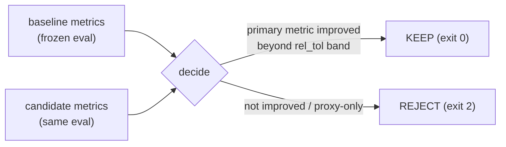
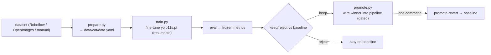
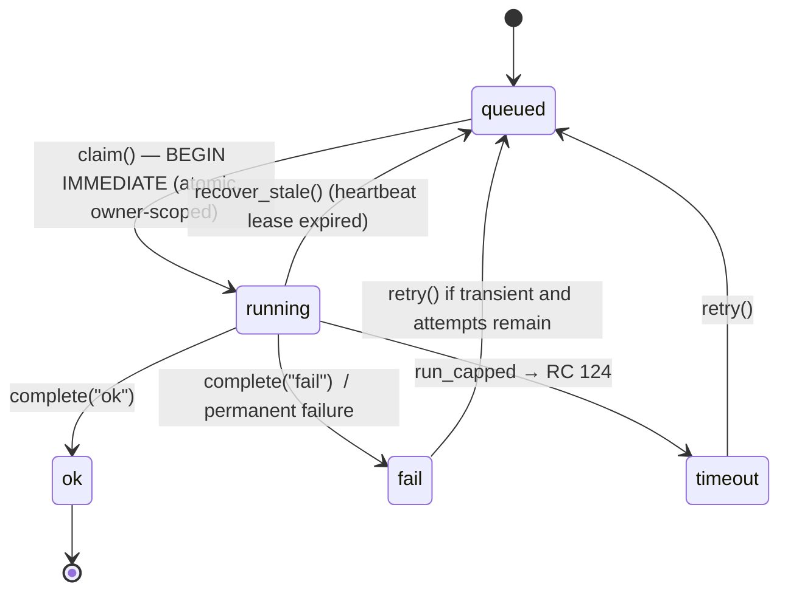
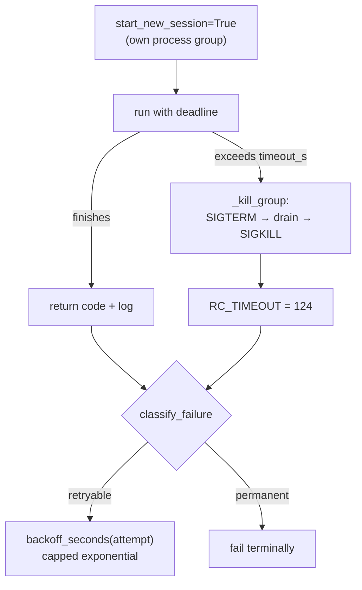
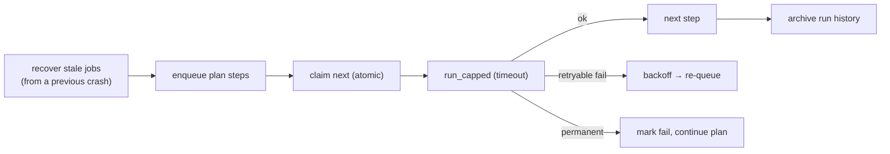

# Training, Evaluation & Reliability

> **TL;DR** — CatRanger **fine-tunes** a pretrained YOLO (never trains from scratch),
> measures every change against the **frozen metrics**, and keeps a change only if the
> metric improves (keep/reject). All heavy work — overnight sweeps and web eval/train —
> flows through one **durable SQLite job queue** that survives crashes: jobs are claimed
> atomically, heartbeated, and recovered if their owner dies. Subprocesses run as isolated
> process groups with a hard timeout, retries use capped backoff, and artifacts are
> written crash-safe (temp → `os.replace` + sha256). **The pretrained baseline always
> runs and can be restored with one command — no fine-tune may block the demo.**

**Modules:** `train/{prepare,train,autoresearch,promote,runner}.py` ·
`eval/{metrics,report,gts,keepreject}.py` · `jobqueue.py` · `proc.py` · `history.py` ·
`scripts/overnight.py` · `web/{eval_job,train_job}.py`.

---

## 1. The training policy (non-negotiable)

From [`../../CLAUDE.md`](../../CLAUDE.md):

1. **The pretrained baseline must always run** — it is the guaranteed demo and safety net.
2. **Fine-tune, don't train from scratch** — no labels/time for scratch; worse
   generalization. "Karpathy" here = the minimal single-file harness + the frozen-metric
   keep/reject loop, not a from-scratch run.
3. **Hard gate:** if a run isn't beating the baseline by its time-box, **revert and ship
   the baseline** (`make promote-revert`).

---

## 2. The keep/reject loop (frozen metric)

`eval/keepreject.py` compares a candidate run against a baseline on the **frozen
metrics**. The primary is **distance MAE** (else FPS when no GT is present); a relative
tolerance band prevents noise from flipping the decision. Crucially it distinguishes
**faithful** metrics (FPS, MAE measured against real GT) from **proxy** metrics
(continuity/smoothness without GT) and won't let a proxy alone justify a keep — explicit
**Goodhart awareness**. `make keepreject BASELINE=base.json CANDIDATE=cand.json`.

### Ground truth (`eval/gts.py`)

Distance MAE is only real with ground truth. `gts.py` loads a GT sidecar
(`gts.json`, template at `configs/eval/how_far.gts.example.json`) and
`align_preds_gts()` pairs predictions to GT by frame index, turning the proxy
continuity/smoothness story into a **measurable** MAE. Without a GT file the harness still
runs and reports FPS/continuity/smoothness, but flags MAE as unmeasured.

### autoresearch (`train/autoresearch.py`)

Runs fixed-budget experiments over the `autoresearch.trials` knobs in `configs/train.yaml`
and keeps a trial only if it beats the frozen metric — the same keep/reject contract,
automated. `make autoresearch`.

---

## 3. Fine-tune pipeline

- `prepare.py` formats a dataset into an Ultralytics `data.yaml`. Sources are registered
  in `configs/datasets.yaml` (`make prepare DATASET=<id>`); `catranger/datasets.py`
  validates the source against `prepare.source_names()`.
- `train.py` is the single-file harness: deterministic seed, frozen metric
  (`metrics/mAP50-95(B)`), `--resume {auto,never,force}` (Ultralytics `resume=True` from
  `last.pt`), `--device`. `make train`.
- `promote.py` wires a winner into the live pipeline **gated and baseline-safe**;
  `make promote-revert` rolls back to the pretrained baseline instantly.

---

## 4. Durable job queue (`jobqueue.py`) — the reliability backbone

All heavy work is a row in `runs/jobqueue.sqlite3` (SQLite **WAL**, `busy_timeout`). The
web server *and* the overnight runner share it, so the same job is never run twice.

### State machine

Terminal statuses: `ok`, `fail`, `skipped`, `timeout` (`TERMINAL_STATUSES`).

### How crash-safety is achieved

| Mechanism | Function | What it prevents |
|---|---|---|
| **Atomic claim** | `claim()` with `BEGIN IMMEDIATE` | two workers running the same job |
| **Owner scoping** | every claim/recover carries an owner id | one worker stealing another's live job |
| **Heartbeat lease** | `heartbeat()` + `recover_stale()` | a dead worker's job stuck "running" forever |
| **Orphan sweep** | `fail_orphans()` | rows whose process vanished |
| **Idempotent upsert** | `record_running()` `ON CONFLICT` | duplicate rows on resume |
| **Retry ladder** | `retry()` + `backoff_seconds()` | thrashing on transient failures |

`make jobs` (or `GET /api/jobs`) renders live queue state.

---

## 5. Subprocess discipline (`proc.py`)

Heavy commands run through `run_capped(cmd, cwd, timeout_s)`:

- **Process-group kill** (`os.killpg`) tears down the *whole* child tree — a hung
  Ultralytics run can never leak orphan workers or wedge the demo.
- A **bounded post-kill drain** avoids hanging on a child that ignores SIGTERM.
- `classify_failure(rc, log)` decides `retryable` vs `permanent`; `backoff_seconds`
  spaces retries with capped exponential backoff.

---

## 6. Crash-safe artifacts (`history.py`)

Run outputs are written **atomically**: a temp file, then `os.replace` (atomic rename),
with a **sha256** recorded in `meta.json`. A crash mid-write never leaves a half-written
artifact that a later run would trust. The run-history archive is indexed at
`runs/history/INDEX.md` (`make history`).

---

## 7. Unattended overnight runner (`scripts/overnight.py`)

The overnight plan (`configs/overnight.yaml`) is the end-to-end reliability story:

- Resumes after a crash/kill: `recover_stale` re-queues anything left running, and
  `--fresh` starts a clean plan. `make overnight`.
- `job_timeout_min` and `max_attempts` come from `configs/overnight.yaml`.
- Because eval/train/sweeps all flow through the **same** queue and the **same**
  `run_capped`, the web console's `/api/jobs` shows overnight progress live too.

---

## 8. Web eval/train integration (`web/eval_job.py`, `web/train_job.py`)

Both job kinds flow through the generic runtime hooks (`_record_job` / `_heartbeat_job` /
`_settle_job`) via `on_progress` / `on_settle` callbacks, so eval, training, and overnight
sweeps share **one** observability surface (`/api/jobs`) and **one** recovery path. A
training run holds the GPU, so the runtime refuses a drive-mode switch (HTTP 409) until it
finishes or is cancelled — no silent GPU starvation, no killed run.

---

## 9. What this buys the demo

- A fine-tune can hang, crash, or be killed — the queue recovers, the baseline still runs,
  and the live demo is never blocked.
- Every "improvement" is proven against a frozen metric with GT, not vibes.
- One command (`make promote-revert`) returns to the guaranteed-good baseline.
