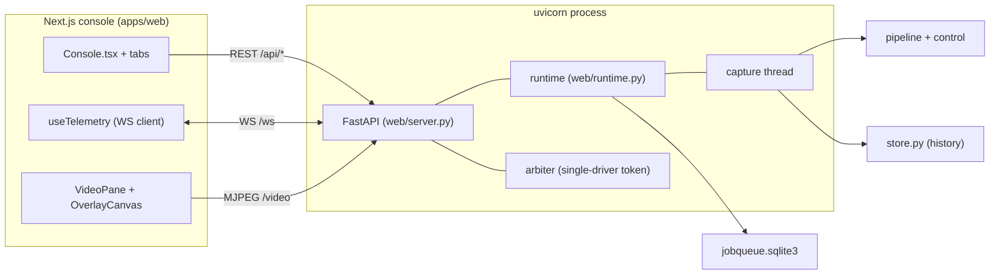
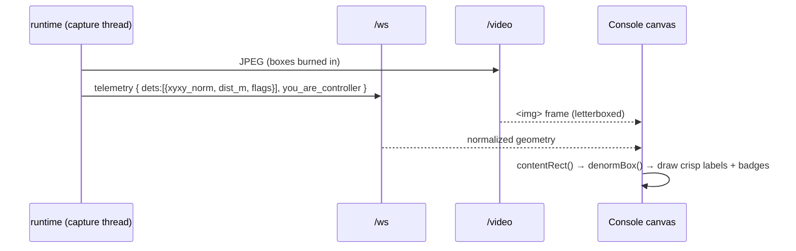
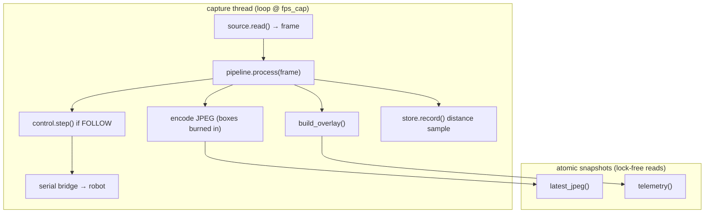
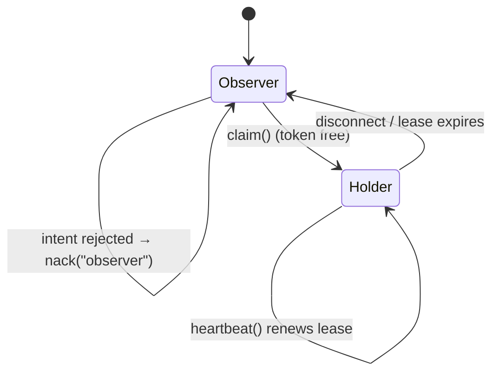

# Web Control Plane

> **TL;DR** — `catranger serve` runs a **FastAPI** server (`web/server.py`) wrapping a
> **runtime orchestrator** (`web/runtime.py`) that owns a background capture thread
> (grab → perceive → encode). A **Next.js console** (`apps/web`) talks to it over three
> channels: **REST** for commands, a **WebSocket** for live telemetry + overlay geometry,
> and an **MJPEG** stream for video. A **single-driver arbiter** prevents two operators
> from fighting over the robot, **E-stop is never gated**, and heavy eval/train jobs are
> serialized behind one lock and tracked in the durable queue.

**Modules:** `web/server.py` · `web/runtime.py` · `web/controller.py` · `web/arbiter.py`
· `web/registry.py` · `web/sources.py` · `web/overlay.py` · `web/store.py` ·
`web/eval_job.py` · `web/train_job.py` · frontend `apps/web/`.

---

## 1. Topology

The console is also deployable standalone (Vercel) as a public landing page; the live
control features only light up when pointed at a running local server. See
[`apps/web/README.md`](../../apps/web/README.md).

---

## 2. The three transport channels

| Channel | Path | Direction | Carries | Why |
|---|---|---|---|---|
| **REST** | `/api/*` | request/response | commands, config, reports | idempotent control + queries |
| **WebSocket** | `/ws` | bidirectional | telemetry + overlay out; drive intents in | low-latency control loop |
| **MJPEG** | `/video` | server→client stream | JPEG frames with **boxes burned in** | one heavy pixel path, browser-native |

### Hybrid overlay (WS-B0/B1/B2)

The boxes are drawn **server-side** into the JPEG; the **text, distances, and failure
badges** are drawn **client-side** on a `<canvas>` from the WebSocket's normalized
geometry (`web/overlay.py` → `build_overlay`). The canvas is aligned to the
`object-contain` letterboxed video using `apps/web/src/lib/letterbox.ts`
(`contentRect`/`denormBox`), so labels stay crisp at any zoom while pixels travel once.

Badge selection/precedence and flapping suppression live in
`apps/web/src/lib/badges.ts` (`pickBadge`, `BadgeDebouncer.retain()`), keyed by track id.

---

## 3. Runtime orchestrator (`web/runtime.py`)

The runtime is the single owner of all mutable robot/camera/model state. A **background
capture thread** runs the hot loop so HTTP handlers never block on the GPU:

Responsibilities:

- **Model home** — `select_model()` / `_build_ranger()` rebuild the pipeline from a fresh
  `load_app` + camera re-anchor + `apply_profile`, so swapping a model is atomic and never
  leaves stale class maps (`apply_profile` clears stale `classes`).
- **Camera adapters** — `connect_camera()` (`web/sources.py`): synthetic, file/RTSP,
  webcam, Tapo. Re-anchors intrinsics on profile change.
- **Robot adapters** — `connect_robot()`: dummy / serial / BLE (`hw/*`).
- **Heavy jobs** — `start_eval` / `start_train` run behind one `heavy_lock`, spawn a
  process-group subprocess, and wire the durable queue (`_record_job` / `_heartbeat_job`
  / `_settle_job`). A heartbeat (`_HEAVY_HEARTBEAT_S`) keeps the row alive; a crash leaves
  a recoverable row. See [training-and-reliability.md](training-and-reliability.md).
- **Safety** — `estop()` latches; `set_mode()` refuses MANUAL/FOLLOW while training holds
  the GPU (HTTP 409) and refuses any mode change while E-stop is latched.

---

## 4. Single-driver arbiter (`web/arbiter.py`)

Many browsers can watch; only one can drive. The arbiter hands out a **control token**
with a lease:

- Telemetry is **per-connection**: every client gets the same robot state plus
  `you_are_controller` and `controller_id`.
- **E-stop and reset are never gated** — any client, holder or not, can stop the robot.
  This is checked *first* in the WS handler, on purpose.
- Drive intents and mode changes require the token (auto-claimed if free); otherwise the
  server replies with a `nack`.

---

## 5. Console structure (`apps/web`)

Next.js 16 / React 19 / TypeScript (strict). Tabs in `src/components/console/`:

| Tab / component | Purpose |
|---|---|
| `Console.tsx` | shell + tab routing |
| `VideoPane.tsx` + `OverlayCanvas.tsx` | MJPEG video + canvas overlay (boxes/labels/badges) |
| `CameraPTZ.tsx` | Tapo pan/tilt controls |
| `DrivePad.tsx` | manual drive (sends WS intents) |
| `SafetyHeader.tsx` + `StatusBanner.tsx` | E-stop, mode, latched-state banner |
| `TelemetryStrip.tsx` | live distance/FPS/state readout |
| `ConnectionsTab.tsx` | connect camera / robot, device discovery |
| `ModelsTab.tsx` | list/select detector models |
| `CVTab.tsx` | training controls + readiness |
| `EvalTab.tsx` | run eval, view report |
| `TrainingTab.tsx` | training run + history + promote |

Libraries in `src/lib/`: `api.ts` (REST), `useTelemetry.ts` (WS + types), `letterbox.ts`
(overlay alignment), `badges.ts` (failure badges), `stopReasons.ts`, `content.ts`.
Tested with **vitest** (`letterbox.test.ts`, `badges.test.ts`); gates = vitest +
`tsc --noEmit` + eslint (`make web-test`).

---

## 6. Failure behavior (real-time visualization of problems)

The overlay surfaces perception failures as **per-detection badges** instead of silently
showing a wrong number:

| Flag | Meaning | Source |
|---|---|---|
| `low_conf` | detection confidence below threshold | `conf < overlay.low_conf` |
| `wide_ci` | distance CI half-width too large | `half_width > wide_ci_frac · meters` |
| `depth_geom_disagree` | the two distance cues disagree | `|geom−depth|/max > disagree_frac` |
| `no_distance` | no usable distance this frame | distance method `none` |
| `no_detections` / `no_frame` | global: nothing to show / no frame | `global_flags` |

Thresholds are display heuristics (not scored core) and come from `configs/web.yaml`
`overlay:`. See the exact contract in [reference/api.md §overlay](../reference/api.md).

---

## 7. Endpoints at a glance

Full reference (request/response shapes, error envelope) in
[reference/api.md](../reference/api.md). Summary:

- **Control:** `POST /api/control`, `/api/mode`, `/api/estop`, `/api/reset`
- **Models:** `GET /api/models`, `POST /api/models/select`
- **Camera:** `POST /api/camera/{connect,disconnect,ptz,ptz/preset}`
- **Robot:** `POST /api/robot/{connect,disconnect}`, `GET /api/robot/discover`
- **Eval:** `POST /api/eval/{run,cancel}`, `GET /api/eval/{status,report}`
- **Train:** `GET /api/train/{readiness,status,report,history}`, `POST /api/train/{run,cancel,promote}`
- **Observability:** `GET /api/status`, `/api/history`, `/api/jobs`, `/healthz`
- **Streams:** `GET /video` (MJPEG), `WS /ws` (telemetry/control)
