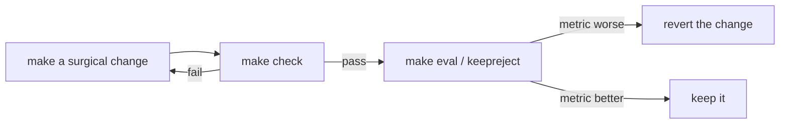

# Command Reference

> **TL;DR** — Three entry points: **`make`** for the common workflows (the canonical way),
> the **`catranger`** console-script for the package, and **`scripts/*.py`** for the demo
> and tools. `uv` manages the environment; `make check` is the full quality gate. Every
> command is a *checkable goal* — run it, read the printed metric, loop until it passes.

---

## `make` targets

### Setup & environment
| Target | Does |
|---|---|
| `make install` | sync core + dev toolchain into `.venv` |
| `make install-ml` | also install perception/depth deps (torch/ultralytics/transformers) — big |
| `make install-web` | install web panel deps (fastapi/uvicorn) + ml for detection |
| `make web-setup` | install console deps (Python web extra + pnpm) |
| `make lock` | refresh `uv.lock` after changing dependencies |
| `make data` | symlink the provided contest inference sets into `data/raw/` |
| `make doctor` | check installed backends + GPU |
| `make fetch-weights` | pre-download detector weights so the demo runs offline |
| `make clean` | remove generated outputs + tool caches |

### Run
| Target | Does |
|---|---|
| `make serve` | launch the web control panel (http://localhost:8080) |
| `make web` | run FastAPI + the Next.js console together (cross-platform) |
| `make demo` | run the demo on `$(SOURCE)` (default: provided how_far stills) |
| `make demo-video SOURCE=...` | run the demo on a cat video |

### Evaluate & train
| Target | Does |
|---|---|
| `make eval [GTS=path]` | run the eval harness + report (GTS path enables distance MAE) |
| `make keepreject BASELINE=base.json CANDIDATE=cand.json` | keep/reject a change on the frozen metrics |
| `make prepare [DATASET=<id>]` | format a cat dataset (uses `configs/datasets.yaml`) |
| `make train` | fine-tune YOLO (baseline-first; never blocks the demo) |
| `make autoresearch` | frozen-metric keep/reject hyperparameter loop |
| `make overnight` | run the unattended overnight plan, archive history |
| `make promote` | wire the fine-tune winner into the pipeline (gated; baseline-safe) |
| `make promote-revert` | roll the pipeline back to the pretrained baseline |

### Observe & calibrate
| Target | Does |
|---|---|
| `make history` | print the run-history archive index (`runs/history/INDEX.md`) |
| `make jobs` | print the durable job queue (sibling of `GET /api/jobs`) |
| `make calibrate H=0.297 Z=2.0 PX=240` | re-anchor camera `fx/fy` (A4 @ 2 m, 240 px) |

### Quality gates (CI parity)
| Target | Does |
|---|---|
| `make lint` | ruff lint (safe autofixes) |
| `make format` | ruff format |
| `make typecheck` | mypy (the package) |
| `make test` | pytest + coverage (`fail_under = 85`) |
| `make check` | **everything CI runs**: format-check, lint, types, tests |
| `make web-test` | console's TypeScript unit tests (vitest) |

---

## `catranger` console-script

Installed by the package (`pyproject` → `catranger = catranger.cli:app`).

| Subcommand | Does |
|---|---|
| `catranger doctor` | check environment / installed backends |
| `catranger info` | print the resolved config |
| `catranger demo …` | run the demo (forwards args to `scripts/demo.py`) |
| `catranger serve …` | launch the web control panel |
| `catranger prepare …` | dataset acquisition/formatting (training pipeline) |
| `catranger train …` | fine-tune YOLO (training pipeline) |
| `catranger autoresearch …` | keep/reject hyperparameter loop |

---

## `scripts/*.py`

### `scripts/demo.py` — the perception demo
Runs detect→track→distance on a source and prints per-cat distance.
```bash
python scripts/demo.py --source data/raw/how_far --camera go2_1080p
python scripts/demo.py --source path/to/cat.mp4 --camera go2_1080p --show
python scripts/demo.py --source "rtsp://USER:PASS@IP:554/stream1" --camera tapo_c211 --show
python scripts/demo.py --source data/raw/how_far --model rtdetr-l    # pick a registry model
```
Key flags: `--source`, `--camera {go2_1080p,tapo_c211}`, `--model <id>`, `--show`,
`--control`, `--connection {dummy,usb,bt,ble}`, `--hw-port`, `--baud`, `--ble`.

### `scripts/overnight.py` — unattended runner
```bash
python scripts/overnight.py                 # run configs/overnight.yaml (resumes if crashed)
python scripts/overnight.py --fresh         # start a clean plan
```

### `scripts/test_link.py` — bench-test the robot link (no camera/ML)
Confirms pairing, the serial/BLE link, the `C dx dy rot pan` → `D <cm>` protocol, the
servo, and the HC-SR04 — in isolation. Servo-only by default (safe); `--drive` pulses the
wheels.
```bash
python scripts/test_link.py --connection bt --hw-port /dev/cu.HC-05-DevB --baud 9600
```

### `scripts/calibrate_camera.py` — re-anchor intrinsics
```bash
python scripts/calibrate_camera.py --camera tapo_c211 \
    --known-height-m 0.297 --distance-m 2.0 --pixel-height-px 240
```

### Module CLIs
```bash
python -m catranger.train.prepare --dataset <id>           # = make prepare
python -m catranger.eval.keepreject base.json cand.json    # = make keepreject
python -m catranger.jobqueue                               # = make jobs
```

---

## The keep-until-it-passes loop

Per CLAUDE.md, every command is a checkable goal. The canonical loop:



Never hand-wave "should work" — run the check.
